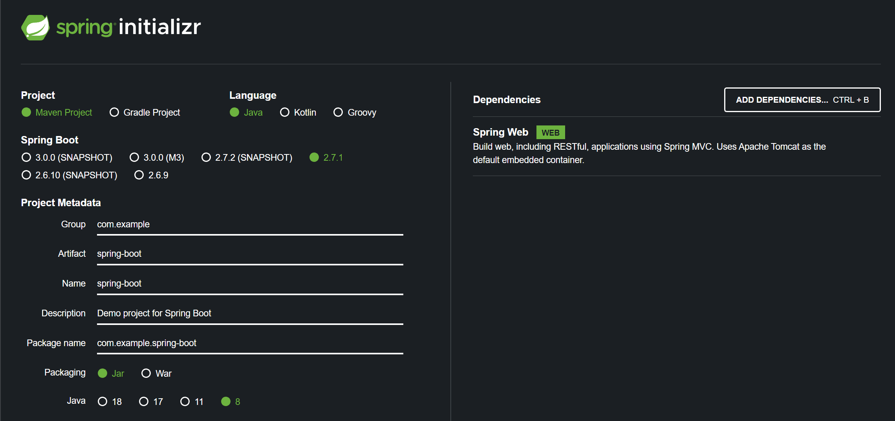

Use this [template](https://start.spring.io/#!type=maven-project&language=java&platformVersion=2.7.1&packaging=jar&jvmVersion=1.8&groupId=com.example&artifactId=spring-boot&name=spring-boot&description=Demo%20project%20for%20Spring%20Boot&packageName=com.example.spring-boot&dependencies=web):  

Follow instructions here and stop before "Add Unit Tests":  
https://spring.io/guides/gs/spring-boot/

Get JAR file here and run:  
`./mvnw package && java -jar target/gs-spring-boot-docker-0.1.0.jar`

Go to http://localhost:8080 to make sure the app is working.

Build the docker image  
`docker build -t spring-boot:latest .`

Run the docker image  
`docker run -d -p 8080:8080 spring-boot:latest`